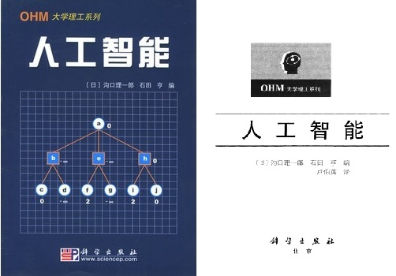

   
##起因
一个偶然的机会，在图书馆发现了这本由[日]沟口理一郎，石田 亨 编，卢伯英译，科学出版社在2003年出版的关于“人工智能”的书，书很薄，打开里面看了几眼，顿感作者高屋建瓴，聊聊几笔，将诺大的人工智能学科说得很透彻，脉络清晰，随萌发一种念头，在自己的网站上，利用GitBook这种工具进行发布并利用当下时兴的GitHub进行协作整理，以启迪后来之青年才俊。

@发起人:[张正轩](<https://github.com/mindcont/AI>)，博客：<http://blog.mindcont.com>，Github：<https://github.com/mindcont>。如果您偶然看到了这个页面，并愿意和我一起将本书重新整理，请发送邮件bond@mindcont.com告知，我会对后续事宜与您沟通。

2016年3月7日

####License
#####声明
书籍的版权归原作者和其出版社所有，如有侵权，请发送邮件bond@mindcont.com。

本作品由<https://github.com/mindcont/AI>创作，采用[知识共享 署名-非商业性使用-相同方式共享 4.0 国际 许可](http://creativecommons.org/licenses/by-nc-sa/4.0/)协议进行许可。

##前言
#####[日]沟口理一郎，石田 亨编

近年来，虽然出版了一些有关人工智能的优秀著作，但还是不断听到人们抱怨，因为至今还缺少一种适合于大学工科专业半年用的、相当于两个学分的教科书。这种教科书既要简明扼要，又要能涵盖本学科的要点。可能是由于人工智能的研究历史比较短，研究对象涉及的范围又非常广泛，再加上阐明人工智能的学科理论尚未完全确立等原因，造成了目前这种状况。  

基于对这种状况的认识，编者在编写这部适合于半年两学分的人工智能人门教材时，在内容安排方面进行了认真考虑，对造成目前状况的原因中，一些有可能得到解决的问题，认真地研究了它们的解决方法。

编写本书时，首先要做的事是确定基本观点。这里存在着两种不同的要求:一种是从进行人工智能研究的观点出发，它着眼于培养未来的人工智能研究新人，因此要求本书在选材上，应注重对他们进行系统完善的知识培养;另一种观点则认为在选材上，不仅要考虑到对与信息工程相关学科的学生有用，而且还要考虑到对那些需要应用人工智能的其他学科的学生也有用。但是在有限的篇幅内，要作到两全齐美是困难的。因此，根据本系列丛书以及本教科书的编写宗旨，采纳了第二种观点进行编写。  

其次要解决的问题是确定要编写的内容。除了概述一章外，共设置六章，涉及六个课题.分别是通过搜索解决问题、知识表示与推理、机器学习、模糊理论一神经网络一遗传算法、模式识别，以及人工智能的语言。编者认为，这些内容是人工智能研究中的基础知识，而且对于应用人工智能技术的学生来说，也是必要而且充分的一些课题。再次是关于执笔者的选定问题。这时有两种方案可供选择，一种方案是把这一题材广泛的教材，托付给一位执笔者去完成，另一种方案是针对各个课题，聘请精通该课题的专家分头编写，本书采用了后一种方案。这种作法，可以实现对每一个课题都进行恰如其分地描述，但是同时，在各课题的描述风格和子课题的选择等方面，也可能会导致不一致，然而由于编者负有统编全书的责任，所以这种因分头编写产生的问题，会得到合理解决。实际上，编者聘请了七位富有朝气的学者作为本书的执笔者，他们都是所承担课题方面的专家，而且两位编者独立地对全书草稿仔细阅读以后，进行了统一批注，然后在与执笔者进行详细讨论后，对内容进行了修改，通过对全书的修订，尽力保证了全书的一致性。

各章在技术和理论的阐述过程中，加进了一些热门话题，并且还以加边框的形式，插入了一些学术方面的最新动向等信息，以设法引起读者的兴趣。此外，在每章的最后还编排了一些练习题，并在书末一并给出了练习题的简要解答。另外，还介绍了一些经过精心挑选的文献，可以作为读者进一步学习时的参考，这些文献也适合于学生们进行自学。

本书就是通过上述运作完成的。编者和执笔者通过共同努力，竭尽全力希望把本书编写得最好，但是对本书的最终评价，当然还是要由读者来进行。本书可以用来作为学生研究人工智能的人门书籍，如果本书能对读者有所帮助，编者将感到荣幸。

####编者
