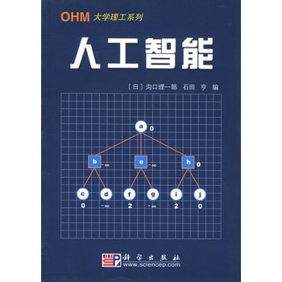

   
## 丛书序
###主编 樱井良文 
  现在，很多大学正在进行院系调整以及学科、专业的重组，以研究生培养为重点，引入学期制，采用新的课程体系授课，特别是由于学期制教学计划的引入，使得原来分册编写的教材很难在一个学期的教学中消化。因此，各学校对“易教”、“易学”教材的需求越来越迫切。    

  本系列是面向通信、信息，电子、材料，电力、能源，以及系统、控制等多学科领域的新型教学参考系列。系列中的各册均由活跃在相应学科领域第一线的教授任主编，由年轻有为的学者执笔，内容丰富、精炼，有利于对学科基础的理解。设计版面时着意为学生留出了写笔记的空间，是一种可以兼作笔记，风格别致的教学参考书。

  希望肩负新世纪工程技术领域发展重任的青年读者们，通过本教程系列的学习，建立扎实的学科基础，在实践中充分发挥自己的应用能力。
  
###OHM大学理工系列编辑委员会
||姓名|单位|
| -- | -- | -- |
|主编| 樱井良文|大阪工业大学校长 京都大学名誉教授|
| 副主编  | 西川伟一  | 大阪大学名誉教授 |
   
###编委(按姓氏笔画顺序)
|姓名|单位|姓名|单位|
| -- | -- | -- | -- |
|广獭全孝 | 广岛大学教授| 井口征士 | 大阪大学教授 |
| 木村磐根 | 大阪工业大学教授 京都大学名誉教授| 仁田旦三 | 东京大学教授 |
| 白井良明 | 大阪大学教授 | 西原浩 | 大阪大学教授 |
| 池田克夫 | 京都大学教授 | 滨川圭弘 | 立命馆大学副校长 大阪大学名誉教授 |

