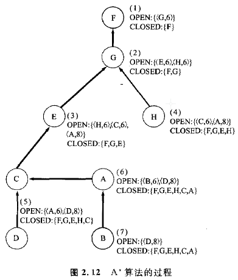
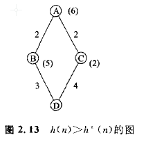

### 2.3.3 A *算法
为什么用最佳优先搜索算法不能得到最优解呢?当考虑这个问题时，我们发现，这是因为**忽略了始于初始节点的代价造成**的。因此，节点n的评价值可以定义如下:

**f(n)=g(n)+h(n)**

这里,g(n)是从初始节点到节点n的路径代价的估计值，h(n)是从节点n到目标节点的路径代价的估计值。设f(n)为评价函数，**则能满足h(n)的估计值是实际的最优值h`(n)的下界函数**这一条件的搜索算法，称为**A* 算法**。

**算法6**  A’算法   

    第1步:将初始节点Ni和它的代价f(Ni)=g(Ni)放人OPEN表中;
    第2步:把OPEN表中最前面的节点取出来，并设其为n。
          如果OPEN表是空的，则求解以失败告终;    
    第3步:扩展节点n，得到子节点的集合，把n放人CLOSED表;    
    第4步:对于子节点的集合中不包含在CLOSED表中的节点n'，配置指向n的指针。
          计算g(n') =g(n)+c(n, n')，并且放人OPEN表中。
          但是在n'已经放入OPEN表的情况下，当新的g(n')比估的值小时，
          则应予以更新，指针也应予以更换。在n'已经放人CLOSED表中的情况下，
          当新的g(n')比估的值小时，则应从CLOSED表中取出，放人OPEN表，
          并且更换指针。对于OPEN表，按照评价值递增的顺序进行分类;
    第5步:返回到第2步。
    
搜索过程如图2. 12所示。

**与均一代价搜索比较，这里不对D进行扩展**。显然，这时只通过7次扩展就可以得到解答。但是在A*算法中，正如第4步表示的那样，会发生放人Closed表中的节点被再次放入OPEN表的情况。

**在A*算法中，h(n)<=h*(n)是能够找到最优解的必要条件**。不能满足这个条件的算法称为A算法，它不能保证得到最优解。图2. 13是它的一个例子。

另一方面，如果A*在状态空间图中的解存在，则能保证最终可以求得最优解。

另外，设存在着两个A* 算法 A1 和 A2 并设它们的启发函数分别为 h1 和 h2 如果对于所有的节点n，满足h1(n)>h2(n) ，则可以证明由A2扩展的节点数比由A1的扩展的节点数多。

**这表明启发函数更加接近于真值，于是搜索效率便越高。**
即如果h(n)=h*(n)，则这时的解可以说就表示一个预先明确的问题了。此外，在h(n)=0的情况下，它属于一种完全没有提供有关解的信息的情况，这时它变为与均一代价搜索等价的情况。

---
** 整理:[mindcont](https://github.com/mindcont)-原著 《人工智能》 [日]沟口理一郎 石田 亨编 **

2016-06-04 第一次编辑