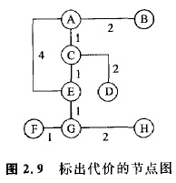
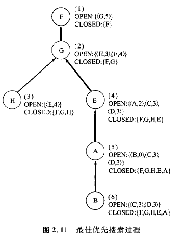

### 2.3.2 登山法和最佳优先搜索
**登山法**是采用启发式的一种最简单算法。现在我们来介绍这种方法。
**算法5**  登山法  

    第1步:设初始节点为n;    
    第2步:如果节点n为目标节点，则求解以成功告终;    
    第3步:扩展节点n，得到子节点的集合;    
    第4步:从子节点的集合中，选取h(N')为最小的节点n'。如果h(n)<h(n')，则求解以失败告终:    
    第5步:设n'为新的n，返回第2步。
    
在这个算法中，如果把**h(n)**看作是到**达山顶(目标节点)的距离**，则因为h(n)的值是向着减小的方向进行搜索，所以看起来恰似进行登山时的情况。不过当这样的节点不再存在时，就会以失败而告终。即当登山途中遇到小的山峰时，就会产生不能由此继续完成原来进程的问题。

在图2. 9中的节点G以后，若选择H,则此后就会发生走投无路的情况。

**这种情况可以说与前面介绍过的随机搜索中产生的问题是相同的**。因此，人们试探地构成了加进OPEN表和Closed表的算法。这里对于前面的算法4，可以只根据g(n)的替代量h(n)的值，对OPEN表进行分类。这时的搜索过程如图2. 11所示。

这种算法称为**最佳优先搜索**。**最佳优先搜索不必担心以前的代价，只需选择能使将来的代价预测值变成最小的路径。**这种算法可以保证能够找到解，而且它可以在许多场合中高效地运行。如果把这种搜索与均一代价搜索进行比较，则可知节点C和D此时不会被扩展，而且显然只通过6次扩展就可以求出解来。**不过由这个结果也可以发现，最佳优先搜索不能保证获得最优解。**

