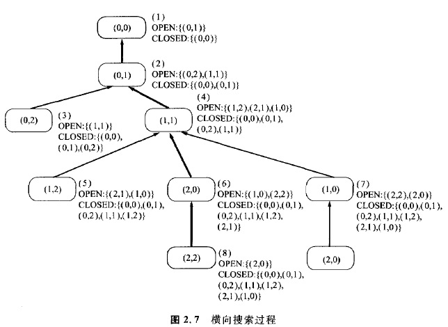
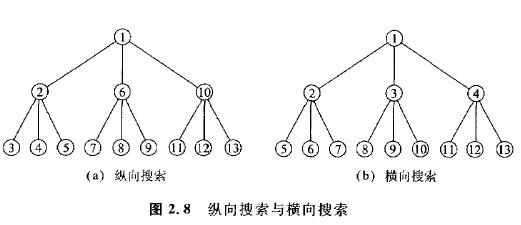

### 2.2.5 横向搜索

下面我们考虑假设OPEN表以“先人先出”的原则排队时的情况。这时图2. 3中状态空间图的搜索过程变成为图2. 7所示的搜索过程。

这种算法称为**横向搜索(或广度优先搜索)**。这种算法的特点是。对展开得到的所有子节点都进行扩展后，再对新的子节点进行展开。横向搜索与纵向搜索不同，例如即使设节点图为无限的，如果解存在，那么这种算法就能够求出这个解。在后面介绍的定理2.2中，上述结果作为一种特殊情况可以得到证明。这里用图2. 8中表示的节点树，清楚地揭示了纵向搜索与横向搜索的区别，在图中显示了它们不同的扩展顺序。

