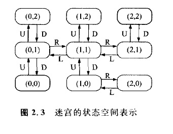
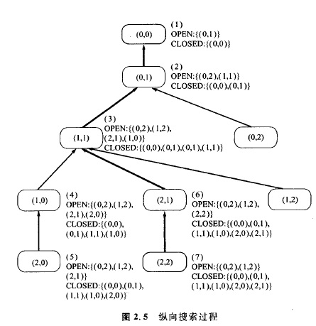
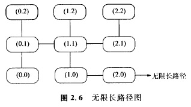

### 2.2.4 纵向搜索

在以前的算法中，对于从OPEN表取出节点的方式，没有作过特别的限制，但是在这里，我们要**假设OPEN表是“后人先出”的存储栈**。

这时，图2. 3所示状态空间图中的搜索过程变成为图2. 5那样的情况。

这里在对节点进行扩展时，假定将子节点存放入OPEN表的顺序为图2. 3中的上(U)、右(R)、下(D)、左(L)的状况。在图2. 5的情况下，被扩展节点的顺序，和那时的OPEN表,CLOSED表的值，均标记于图上。这里因为OPEN表是右侧为出人口的存储栈，所以为了便于进行展开，应注意对表的后面节点的选择。

**这种算法称为纵向搜索(或深度优先搜索)。这种算法的特点是**，要对一个一个新得到的子节点进行扩展，直到不可能再进行扩展为止。因为纵向搜索保持了算法3的性质，所以在节点图为有限的情况中，停止性和完全性将得到保证。可是在图2. 6那样的图为**无限节点的情况下，将会出现所谓算法不能停止的问题**。

---
** 整理:[mindcont](https://github.com/mindcont)-原著 《人工智能》 [日]沟口理一郎 石田 亨编 **

2016-04-21 第一次编辑