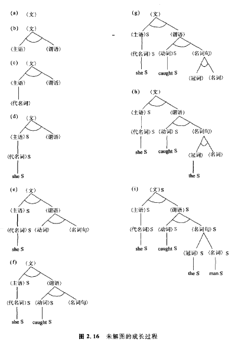

### 2.4.2 与/或(AND/OR)图搜索
AND/OR图搜索是从仅由初始节点构成的未解的图开始，到获得解图的过程中，反复进行的扩展与评估操作。因为未解的图在搜索过程中存在着多种情况，所以采用了与以前的搜索算法相同的OPEN表，对这些情况进行管理。于是AND/UR图搜索算法变成了下列形式。   

**算法7 ** AND/OR图搜索   

    第1步:把仅由初始节点构成的未解图放进OPEN表;    
    第2步:从OPEN表中取出一个节点，设为g。如果OPEN表是空的，则求解以失败告终，
          如果g是解图，则求解以成功告终;   
    第3步:扩展g，得到未解图的集合。对这些未解图进行评估，并将无解图以外的
          子节点放人OPEN表;    
    第4步:返回第2步。

现在我们对第3步中的AND/OR图扩展和评估进行说明。AND/OR图的扩展，是在未解图的端点，将后面谈到的未加标记的节点进行扩展。其子节点如果是AND节点，则对所有的子节点施加作用。如果其子节点是OR节点，则只对各节点中的一个节点施加作用，并且仅由施加作用的子节点数生成未解图。    
 
另外，未解图的评估可以按以下方式进行。对未解图的各端点进行审查，如果是目标节点，则加上S标记。此外，如果是不能作进一步扩展的端点，则加上N标记。对于端点以外的节点，当其节点的子节点为AND节点的情况，且其所有子节点为S时，则应加上S标记。但是即使有一个子节点为N时，则应加上N标记。另外，当子节点为OR节点的情况时，如果它是S，则应加上S标记，如果是N，则应加上N标记。如果初始节点变成为S，则为解图，如果变成为N，则为无解图。另外，如果未加任何标记，则仍然是原来的未解图。    

取图2. 14所示的AND/OR图作为例子，其AND/ OR图的搜索过程表示在图2. 16上。

 

在AND/OR图的搜索方面，关于从OPEN表中提取未解图的方式，曾经考虑过各种方案，但这里只表示了**采用纵向搜索**的例子。图中的S表示标记。图中作了一些省略，在扩展(b)时，不仅在(c)中端点变成了(代名词)，而且还产生了端点变成<名词句>的情况。另外在对(h)进行扩展时，**同样也得到了两种图，这是应当注意的问题**。

