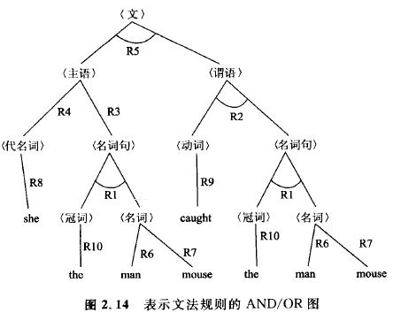
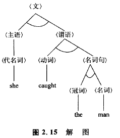

### 2.4.1 与/或(AND/OR)图表示

此前的搜索方法，都是使初始状态(初始节点)通过接连不断地变化，逐渐追寻，最后达到目标状态(目标节点)。**与此相应，也可以根据问题的具体情况，考虑采用先将其分解成几个问题，然后分别进行求解的方法。**这种问题的求解方法，可以作为**AND/OR图搜索**而将其规格化。作为AND/OR图搜索的具体例子，我们来说明文章的构成问题。这里是根据设定的文法规则来构成文章的。例如有下列一些文法。

    R1:<名词句>~(冠词)<名词>    
    R2:<谓语>~(动词>（名词句)    
    R3:<主语>~<名词句)    
    R4:<主语>~<代名词>    
    R5:<文》~<主语)<谓语>    
    R6:<名词>一man    
    R7:<名词>-mouse    
    R8:<代名词>-she    
    R9:<动词>-caught    
    R10:<冠词>-the
    
这里包含在< >中的符号称为非终端符号，不包含在< >中的符号称为终端符号。由<文>开始，并且排出仅由终端符号构成的符号列，就是给出的问题。这里，文法规则R5表示(文)是由<主语>和<谓语>的符号组成的，为了求出满足<主语>和<谓语>各自的符号列，可以用**AND分割分解**为两部分问题。**利用这种方法可以保证，当被分割的所有部分的问题被解决时，原来的问题也得到解决**。    

另外，R3和R4表示满足<主语>的符号列，是<名词句>或<代名词>中的任一种符号列，可以用**OR分割**予以表示。利用这种方法可以保证，当被分割的任意一部分问题被解决时，原来的问题也被解决。    

上述根据文法规则构成的文章生成问题，可以用AND/OR图表示成图2. 14所示形式。
在这里AND/OR分割可以分别用AND/OR分支来表示，为了对它们进行区别，在AND分支中添加了圆弧。由AND分支得到的子节点称为**AND接点**，由OR分支得到的子节点称为**OR节点**。另外，最初给出状态的节点，称为初始节点。**AND/OR图的端点变成为部分解作为目标节点，也可能是相反情况，不作为目标节点**。在文章生成方面，初始节点为非终端符号<文>，终端符号变为目标节点。这里值得注意的是，在AND/OR图搜索中，在刚一发现目标节点的情况下，是不能说找到了解的。

AND/OR图搜索的解称为解图，它是原来的AND/ OR图的一部分，并且具有下列性质。  

    (a)包含初始节点;    
    (b)在某节点具有AND分支的情况下，它将包含其所有子节点;    
    (c)在某节点具有OR分支的情况下，它将包含其所含子节点中的一个子节点;    
    (d)所有的终端节点都是目标节点。   

图2. 15表示了一种文章生成问题的解图，一般来说，对应于一个AND/OR图，存在着多种解图。AND/OR图搜索，是用来寻找由问题定义的AND/OR图中的解图的。

