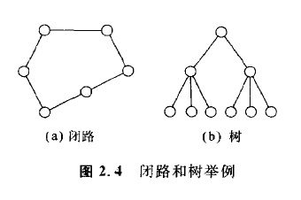

### 2.1.3 与图有关的术语

图2. 3所示的状态空间，可以用**图**来表示，问题的求解也可以看作是在这种图上的搜索。作为以后讨论中的准备工作，首先就有关状态空间图的术语进行归纳整理。    

**状态空间图是由节点的集合和分枝的集合构成的**。节点数目有限的图称为有限节点图。一个分枝连接两个节点。在分枝中，有具有方向的分枝(有向分枝)和不具有方向的分枝(无向分枝)。无向分枝与具有各自方向的两个有向分枝的意义相同。当存在从节点Ni开始指向Nj的分枝时，则称Ni为Nj的**双亲节点**，Nj为Ni的**子节点**。求解节点Ni的所有子状态，称为将节点Ni的**扩展**。当节点的系列为n1，n2,n3,n2,n3,n4 .... nm，且存在着从各个节点n，开始指向Ni的分枝时(1<= i <= m+1)，则称之为从n1，到nm的路径。路径中不包含两个以上的相同分枝，两端的节点如果是相同的，则称这种路径为**闭路**(参考图2.4(a)).   

对于所有不同的两个节点，不考虑分枝的方向，把它们连结起来的路径构成的图称为**连结图**。不构成闭路的连结图称之为**树**。

在用**图来表示状态空间**时，可以相应的用**节点表示状态**，用分枝表示算符。这时与初始状态对应的节点称为**初始节点**，与目标状态对应的节点称为**目标节点**。**因此，所谓的问题求解，就是求出从初始节点到目标节点的路径(即解)**。对于图2. 3来说，从初始节点(0,0)，到目标节点(2,2)的序列(0,0),(0,1),(1,1),(2,1),(2,2)，就变成了问题的解。

---
** 整理:[mindcont](https://github.com/mindcont)-原著 《人工智能》 [日]沟口理一郎 石田 亨编 **

2016-03-12 第一次编辑