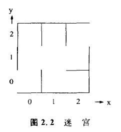

### 2.1.2 状态空间表示

为了用计算机解决问题，首先有必要用程序去表示那些可以进行表示的问题。在解题方法的步骤明朗时，用**流程图(流图)**进行表示，但是在解题方法的步骤不明朗时，可以采用状态空间表示作为问题的表示方法。在这种情况下，我们以机器人从容易迷失方向的格状路段迷宫(也可称为盘陀路)入口(坐标为(0,0))，到出口(坐标为(2,2)）的运行过程为例，对状态空间表示方法加以说明。机器人最初位于入日处，它可以向着相邻的可能进行移动的任何坐标移动。这样在能够到达出口之前，就产生了路径选择问题。

在状态空间表示法中，要求解的问题是以状态和算符集合的形式表示的。在上述问题中，对应于机器人的位置，可以定义出9种状态。例如，机器人在坐标(O,i)的位置上可以用状态(O,i)表示。所谓算符是一种表示状态与状态关系的符号，在本问题中，相应于机器人的移动方向Y(U)下(D)左((l)右(R)
可以定义四个算符。例如·对应于状态((0,1)，可以应用算符U,D,R其应用结果是分别可以变化到状态(o,2),（0,0）,(1,1）。这种状态与算符的关系可以用图2. 3所示的状态空间图表示。

不论是什么问题，都具有求解前的状态和求解后的状态，前者称为**初始状态**，后者称为**目标状态**。在迷宫问题中，机器人进人入口的状态((0,0)是初始状态，进人出口的状态(2,2)是目标状态。而且所谓的问题求解，就是依次应用可以应用的算符，将初始状态变化到目标状态。在图2. 3所示的例子中，如果对初始状态依次应用算符U,R,R,U，则可以变化到目标状态。

---
** 整理:[mindcont](https://github.com/mindcont)-原著 《人工智能》 [日]沟口理一郎 石田 亨编 **

2016-03-12 第一次编辑