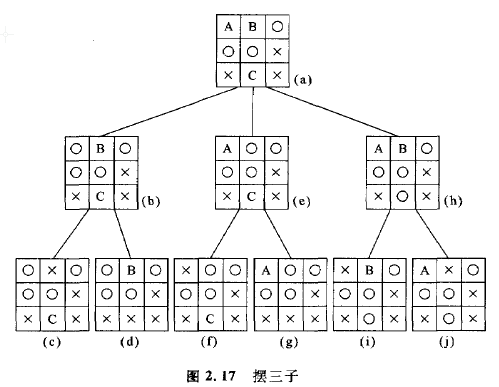
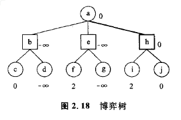
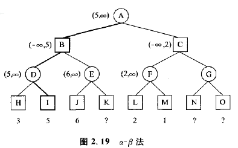

### 2.5 博弈树的搜索
在象棋和国际象棋等这些由两人进行的比赛中，两个棋手通过交替地走棋，进行比赛。在这种2人比赛中，确定下一步的走棋问题，也可以用图搜索的方法进行处理。虽然2人比赛的最终结果，可能是赢、输和平局中的一种，但是作为棋手，当然**要选择自己能够取胜的棋术**。另一方面，对于下一步的棋局，对手要选择使我方变成输局的棋术，**对于对手的这种选择，我方棋手是无法干预的**，这也是2人比赛的一种特征。    

作为具体例子，我们选取图2. 17所示的摆三子的终盘局面(a)。这里O和X在结束前各有三步棋可以走，而且设走第一步的是O。这时存在着三个空格A,B, C，应该把棋子放到哪一格内是需要进行判断的难点问题。如果选择在空格A上，则棋盘局面变成(b)。此后应轮到X走棋，这时可供选择的分枝是剩余的B和C。如果这时X选择f3，则变成平局，如果选择C，则X成为赢局。在这种情况下，X当然会选择C，因此局面(b)被束缚在输局上。

其次，我们来探讨O选择B时的局面(e)。这时X的可选择分枝是剩余的A和C。当X选择A时，O会出现两个并排的局面，虽然赢的可能性仍然存在，但是当X选择C时，却能够确保X的赢局。因此，这时X当然也会选择C，从而把局面(e)束缚在输局上。   

最后，我们来探讨O选择C时的局面(h)。这时X的选择分枝是剩余的A和B。当选择A时，O会出现两个并排局面，当X选择B时，出现了平局局面。因此，在这种情况下，因为X选择了B,所以局面(h)也只能变成平局。    

综合上述分析可以看出，对于在局面(a)中的O来说，最好的选择分枝，是将符号O放在C上，这时可以导致平局局面。    

在进行这种比赛时，**在交替走棋的棋手中，任何棋手都要对后面的状态(局面)进行提前考虑，并且以各种状态的评估值为基础作出最好的走棋选择**。状态评估值的给出方法因问题而异，在摆三子的情况下，赢的评估值设为+无穷，输的评估值设为-无穷，平局的评估值设为a，此外根据与赢局相关连的棋子数目，可以设为0,1,2。**而且这种探讨过程，可以用图2. 18所示的博弈树表示出MAX节点与MIN节点交替出现的情况**。用O表示的**MAX节点**是从那些子节点的评估值中选取的具有最大值的节点，它表示了**自己的棋步**。另外，用口表示的**MIN节点**是从那些子节点的评估值中选取的具有最小值的节点，它表示了**对手的棋步**。反复进行这种评估，就可以得到各个节点的评估值。这种确定棋步的方法，称为**极大极小法**。

在图2.18所示的博弈树中，棋手在这时的最好棋步可以判断如下。图中a,c,d,f,g,i,j为MAX节点，b,e,h为MIN节点。对于节点b，棋手选择d(评估值为-无穷)，对于节点e，选择节点g(评估值为-无穷)，对于节点h，选择节点j(评估值为0)。因此，对于节点a，显然选择h(评估值为0)是最好的棋步。    

**不过在极大极小法中，必须求出所有端点的评估值**，当预先考虑的棋步比较多时，计算量会大大增加。因此，a-b法是一种效率比较高的方法。在a-b方法中，采用了两个变量a和b，它们是最终可以获得的对最大评估值和最小评估值的估计值。下面通过具体例子说明这种方法。

设给出了图2. 19所示的博弈树。首先求出H和I的评估值。这时，因为MAX节点D上的5是确定的，所以在MIN节点B上确定为5以下(b=5)。其次，求得J的评估值为6。因此，MAX节点E的评估值显然为6以上。当这样进行时，对于M工N节点B是不可能选择E的。这就确定了与K的评估值没有关系，所以没有必要去求它的评估值。**这种剪枝，由于节点E的评估值超过了它的双亲节点(节点B)，所以被称为b剪枝。**

这里因为MIN节点B的值确定为5，所以显然MAX节点A的值是5以上(a=5)。接着I.和M的值会被求出来。因为它们分别是2和1，所以MAX节点F的值可以确定为2。这时，可以判定MIN节点C的值为2以下。当这样进行下去时，就可以保证MAX节点A上的值变成5以上。这是与MAX节点G的值没有关系的。因此，也就没有必要去求节点V和O的评估值了。**这种剪枝，由于节点C的评估值低于它的双亲节点(节点A)的a值，故被称为a剪枝。**

---
** 整理:[mindcont](https://github.com/mindcont)-原著 《人工智能》 [日]沟口理一郎 石田 亨编 **

2016-06-04 第一次编辑